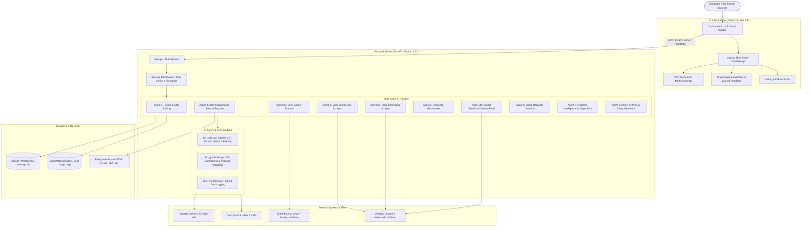

# 02 — SYSTEM ARCHITECTURE & DATA FLOW
**Repository**: `f:/Thnextoppr`  
**Architecture Pattern**: Layered Modular Multi-Agent Monolith (FastAPI + React SPA)

---

## 1. High-Level Architecture Diagram

---

## 2. End-to-End Data & Request Lifecycle

### Request Flow: Resume Upload & Instant ATS Evaluation
1. **User Action**: Candidate drags a `.pdf` or `.docx` file into `<ResumeUploader />`.
2. **Client Request**: `POST /api/profile/upload` via `multipart/form-data` with `X-API-Key`.
3. **Backend Middleware**: Checks `require_auth_or_api_key` and rate limits.
4. **Agent 1 Ingestion**:
   * Extracts raw text via `pdfplumber` or `python-docx`.
   * Sanitizes text and extracts contact info, skills, education, and past roles.
   * Computes 5-pillar mathematical score (0–100) via `compute_ats_score()`.
   * Encrypts raw text with AES-256 Fernet via `encrypt_field()`.
5. **Database Write**: Updates `ProfileModel` row in `nextoppr.db`.
6. **Trigger Auto-Matching**: Runs `compute_match()` against all active jobs in `JobModel`.
7. **Response**: Returns populated `ProfileSchema` with parsed sections, score, and recommendations.
8. **Client Render**: Hot-swaps view to `<ResumeAnalyzer />` with live A4 preview and celebration confetti if score $\ge 85$.

---

### Request Flow: Zero-Hallucination 1-Click Tailoring
1. **User Action**: Candidate clicks *"1-Click Tailor Resume for this Job"* on a matched job.
2. **Client Request**: `POST /api/applications/tailor/{match_id}`.
3. **Backend Ingestion**: Fetches `ProfileModel`, `JobModel`, and `MatchModel`.
4. **Agent 4 Processing**:
   * Constructs prompt wrapping profile and job inside XML boundaries (`wrap_untrusted_content`).
   * Calls `generate_structured_llm_output()` enforcing `TailoredResumeSchema`.
   * Re-scores tailored resume against canonical 5-pillar rubric.
5. **Database Write**: Inserts record into `TailoredResumeModel` and creates/updates `ApplicationModel` (status: `tailored`).
6. **Response**: Returns JSON diff summary (before vs after score, rewritten bullets, skills highlighted).
7. **Export Ready**: Candidate can immediately download formatted `.pdf`, `.docx`, `.tex`, or `.md`.

---

## 3. Database Architecture & Relationships

| Model Name | Table Name | Purpose | Key Foreign Keys |
| :--- | :--- | :--- | :--- |
| `UserModel` | `users` | Candidate auth credentials & preferences | None |
| `ProfileModel` | `profiles` | Candidate resume AST, parsed skills, DPDP consent | None |
| `JobModel` | `jobs` | Curated & scraped opportunities with link health | None |
| `MatchModel` | `matches` | Computed semantic & keyword score between Profile & Job | `job_id -> jobs.id`, `profile_id -> profiles.id` |
| `ApplicationModel` | `applications` | Kanban application lifecycle tracking | `job_id -> jobs.id`, `match_id -> matches.id` |
| `ApplicationEventModel` | `application_events` | Audit log of status transitions and timestamps | `application_id -> applications.id` |
| `TailoredResumeModel` | `resumes_tailored` | Tailored resume snapshot and diff scores | `job_id -> jobs.id`, `match_id -> matches.id` |
| `InterviewPrepModel` | `interview_prep` | Company brief, question bank, and voice mock logs | `application_id -> applications.id` |
| `OutcomeDiagnosisModel` | `outcome_diagnosis` | Bottleneck analysis (e.g., screening drop-off) | `profile_id -> profiles.id` |
| `OutcomeEventModel` | `outcome_events` | Longitudinal hiring funnel milestones | `profile_id -> profiles.id`, `job_id -> jobs.id` |
| `NotificationEventModel`| `notification_events`| In-app notification triggers and delivery status | `profile_id -> profiles.id` |
| `NotificationPreferenceModel`| `notification_preferences`| Digest cadence and channel preferences | `profile_id -> profiles.id` |
| `LearningResourceModel` | `learning_resources` | Curated roadmaps and study resources | None |
| `InterviewQuestionBankModel` | `interview_questions_bank` | 1,000+ technical/behavioral interview questions | None |
| `CodingQuestionModel` | `coding_questions` | DSA catalog with starter code and test cases | None |
| `CodingAttemptModel` | `coding_attempts` | User sandbox execution submissions | `profile_id -> profiles.id` |
| `ResumeTemplateModel` | `resume_templates` | Layout pattern definitions | None |
| `MNCScanLogModel` | `mnc_scan_log` | Diagnostic log of automated portal scraper sweeps | None |
| `LLMUsageLog` | `llm_usage_logs` | Token and cost telemetry audit trail | `profile_id -> profiles.id` |
| `StudyMaterialCache` | `study_material_cache` | Cached study materials with TTL | None |

---

## 4. Multi-Agent System Roles & Boundaries

| Agent | Module File | Responsibility |
| :--- | :--- | :--- |
| **Agent 1** | `agent1_parser.py` | Resume parsing (PDF/DOCX/TXT), 5-pillar mathematical ATS scoring. |
| **Agent 2** | `agent2_discovery.py` | Local and RSS opportunity catalog ingestion. |
| **Agent 2B** | `agent2b_mnc_scanner.py` | MNC direct portal scraping (Google, Microsoft, TCS, Infosys, etc.). |
| **Agent 2C** | `agent2c_india_internships_scraper.py` | Unstop, Cuvette, Internshala, Wellfound, GitHub 2026 campus scraper. |
| **Agent 2D** | `agent2d_global_jobs_scraper.py` | FreeHire 50-ATS aggregator + LinkedIn public guest job scraper. |
| **Agent 3** | `agent3_matching.py` | Multi-dimensional scoring (skills, domain, location, semantics). |
| **Agent 4** | `agent4_tailor.py` & `agent4_export_generator.py` | Zero-hallucination resume rewrite, PDF/DOCX/TeX/MD export generation. |
| **Agent 5** | `agent5_reporting.py` | System-wide metrics, ATS distribution curves, pipeline aggregates. |
| **Agent 6** | `agent6_batch_email.py` | Recruiter cold outreach generator and batch simulation. |
| **Agent 7** | `agent7_outcome_intelligence.py` | Diagnostic bottleneck analysis and automated candidate feedback. |
| **Agent 8** | `agent8_interview_prep.py` | Voice mock simulator, company brief generation, question bank generator. |
| **Source Router** | `source_router.py` | URL canonicalization, ATS classification, link revalidation sweeps. |
