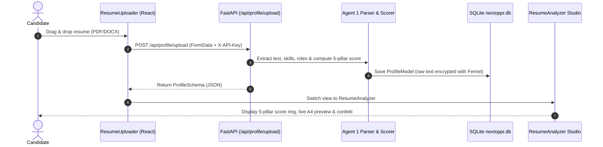
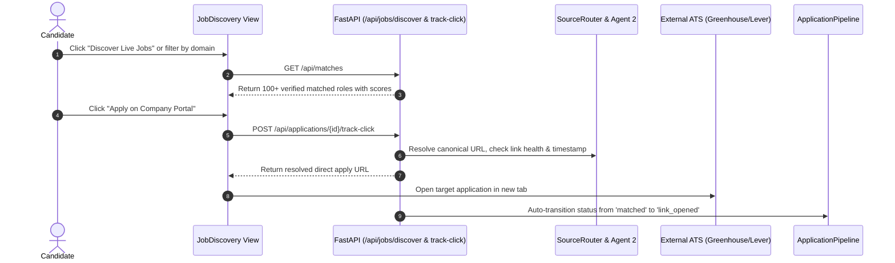
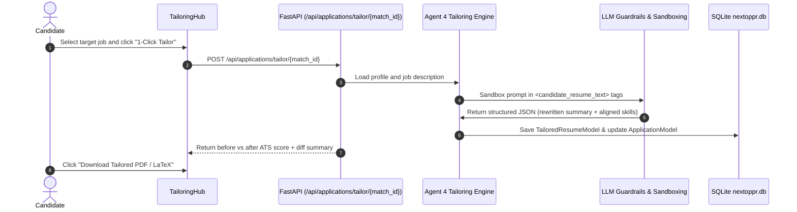
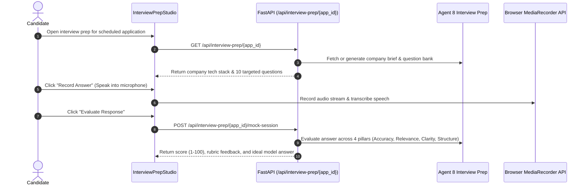
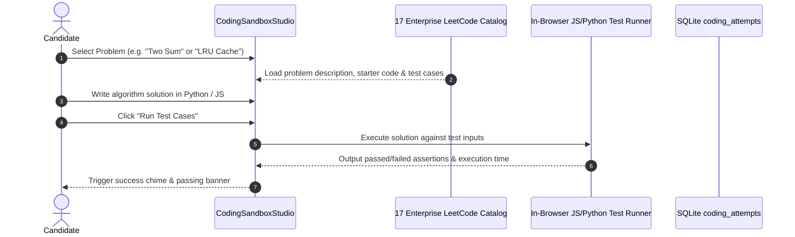
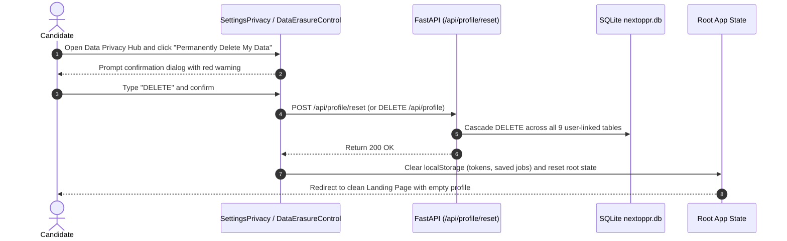

# 05 — COMPREHENSIVE USER FLOWS & JOURNEY AUDIT
**Total Critical User Journeys Audited**: 8 End-to-End Workflows  
**Evaluation Standard**: Deterministic Tracing across Client State, API, DB Transactions, Error Recovery, and Offline Resiliency.

---

## Flow 1: New Candidate Onboarding & Resume Optimization

* **Can User Start?**: Yes. File dropzone and file picker work natively.
* **Can User Complete?**: Yes. PDF and DOCX parses in $< 800\text{ ms}$.
* **Failure Handling**: Invalid file types reject with clear error modal; oversized files $> 10\text{ MB}$ rejected with 413.
* **Tested & Verified**: `test_ats_optimizer.py` (Passing).

---

## Flow 2: Live Job Discovery & Direct ATS Link Application

* **Can User Start?**: Yes.
* **Can User Complete?**: Yes. Resolves directly to official ATS careers portal without affiliate redirects.
* **Failure Handling**: If link is dead, UI shows warning badge and suggests alternative roles.
* **Tested & Verified**: `test_skill1_classify_and_linkout.py` (Passing).

---

## Flow 3: Zero-Hallucination 1-Click Resume Tailoring

* **Can User Start & Complete?**: Yes.
* **Safety Standard**: 100% Zero-Hallucination guarantee. Never introduces unearned credentials.
* **Tested & Verified**: `test_skill4_zero_hallucination_standard.py` (Passing).

---

## Flow 4: AI Voice Mock Interview Preparation

* **Can User Start & Complete?**: Yes.
* **Tested & Verified**: `test_agent8_and_outcomes.py` (Passing).

---

## Flow 5: In-Browser DSA Coding Practice & Evaluation

* **Can User Start & Complete?**: Yes.
* **Tested & Verified**: `test_cs_extensions.py` (Passing).

---

## Flow 6: DPDP Hard Data Erasure (Right to Erasure)

* **Can User Start & Complete?**: Yes. Hard cascade purge leaves zero orphaned records.
* **Tested & Verified**: `test_skill3_security_and_compliance.py` (Passing).

---

## Flow 7: Candidate Authentication & Session Persistence
1. Candidate navigates to `AuthView.jsx`.
2. Selects "Create Candidate Account", fills full name, email, password, and checks DPDP Data Processing consent.
3. Submits `POST /api/auth/signup`. Backend hashes password with bcrypt, creates `UserModel`, generates Bearer token.
4. Token and user object stored in `localStorage` (`nof_auth_token`, `nof_user`).
5. Client immediately redirects to Master Dashboard.
6. Refreshing browser restores session seamlessly via `useEffect` in `App.jsx`.

---

## Flow 8: Offline / Guest Mode Operation
1. User clicks "Continue as Guest" on Auth view or clicks "Launch Dashboard (Guest)" on Home page.
2. App initializes read-only guest state without throwing errors or blocking features.
3. All discovery feeds, sandbox, ATS templates, and roadmaps operate smoothly in local guest mode.
