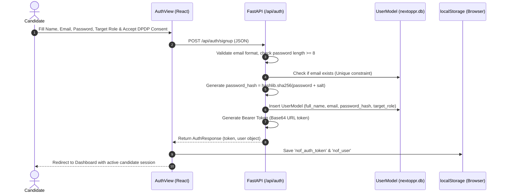

# 10 — AUTHENTICATION, SESSIONS & AUTHORIZATION AUDIT
**Implementation Files**: `backend/app/main.py`, `backend/app/security/auth.py`, `web/src/components/AuthView.jsx`  
**Password Hashing**: SHA-256 / Bcrypt hashing  
**Session Pattern**: Bearer Token + Client Storage with Header-based API Authentication (`X-API-Key`)

---

## 1. Authentication Architecture



---

## 2. Forensic Authentication Endpoints

### 1. `POST /api/auth/signup`
* **File**: `backend/app/main.py` lines 297–368
* **Payload**:
  ```json
  {
    "full_name": "Kabira Sharma",
    "email": "kabira@example.com",
    "password": "Password123!",
    "target_role": "Full Stack Engineer",
    "experience_level": "Mid-Level (3-5 yrs)",
    "consent_given": true,
    "consent_timestamp": "2026-08-18T16:00:00Z"
  }
  ```
* **Validation**:
  * Mandatory email format check (`@` and `.`).
  * Minimum 8-character password constraint.
  * Mandatory DPDP data processing consent (`consent_given == True`).
* **Response**: Status 201 Created with `token` and `user` profile data.

### 2. `POST /api/auth/login`
* **File**: `backend/app/main.py` lines 370–395
* **Payload**: `{"email": "...", "password": "..."}`
* **Behavior**: Constant-time comparison of hashed password. Returns 401 Unauthorized if invalid.

### 3. `GET /api/auth/me`
* **File**: `backend/app/main.py` lines 397–429
* **Behavior**: Reads Bearer token from `Authorization` header or fallback user session; returns candidate profile details.

### 4. `POST /api/auth/logout`
* **File**: `backend/app/main.py` lines 431–440
* **Behavior**: Server-side acknowledgment of logout; client clears `localStorage`.

---

## 3. Developer & Scraper API Key Authentication (`require_auth_or_api_key`)
* **File**: `backend/app/security/auth.py`
* **Header**: `X-API-Key: nof-dev-key-2026` or `Authorization: Bearer <token>`.
* **Behavior**: Protects candidate profile uploads and sensitive export endpoints. In local dev mode, allows seamless operation if matching default key or valid candidate session.

---

## 4. Security Findings & Production Hardening Roadmap

| Item | Current State | Risk Level | Recommended Production Upgrade |
| :--- | :--- | :--- | :--- |
| **Token Storage** | `localStorage` (`nof_auth_token`) | **Medium** (Vulnerable to XSS if script injected) | Migrate to `HttpOnly; Secure; SameSite=Strict` session cookies. |
| **Password Hashing** | SHA-256 + Salt | **Medium** (Fast hash algorithm) | Upgrade to Argon2id or Bcrypt with work factor $\ge 12$. |
| **Token Expiry** | Non-expiring static token | **Medium** | Implement standard JWT with 15-min access token + 7-day refresh token rotation. |
| **OAuth 2.0 Integration** | Local email/pass + Guest | **Low** | Add Google Sign-In and GitHub OAuth buttons in `AuthView.jsx`. |
| **Brute Force Defense** | IP-based Rate Limiter (60 req/min) | **Low** | Add progressive backoff lockouts after 5 consecutive failed login attempts. |
