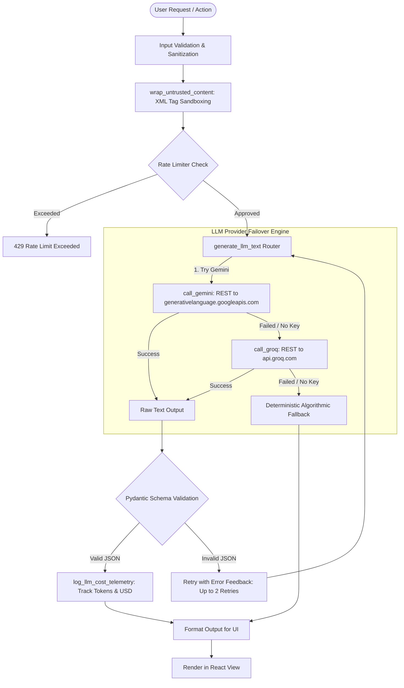

# 12 — AI PIPELINE, LLM INTEGRATION & GUARDRAILS AUDIT
**Primary LLM Model**: Google Gemini 1.5 Flash (`gemini-1.5-flash`)  
**Secondary Failover Model**: Groq LLaMA 3.1 8B Instant (`llama-3.1-8b-instant`)  
**Integration Layer**: Direct HTTP REST (No heavy LangChain/LlamaIndex dependencies)  
**Implementation Modules**: `backend/app/llm_client.py`, `backend/app/llm_guardrails.py`, `backend/app/security/cost_telemetry.py`

---

## 1. AI Pipeline Architecture



---

## 2. LLM Provider Specifications & Cost Models

| Provider | Model Name | Endpoint URL | Default Temperature | Max Tokens | Cost per 1K Tokens (USD) |
| :--- | :--- | :--- | :--- | :--- | :--- |
| **Google Generative AI** | `gemini-1.5-flash` | `https://generativelanguage.googleapis.com/v1beta/models/gemini-1.5-flash:generateContent` | `0.3` | `1024` | \$0.000075 (Prompt) / \$0.0003 (Comp) |
| **Groq Cloud** | `llama-3.1-8b-instant` | `https://api.groq.com/openai/v1/chat/completions` | `0.3` | `1024` | \$0.00005 (Prompt) / \$0.00008 (Comp) |
| **Deterministic Fallback**| Python Rule Engine | Internal / Local In-Memory | N/A | N/A | **\$0.00000 (Free / Offline)** |

---

## 3. Structured Outputs with Bounded Retries (`llm_guardrails.py`)

When calling `generate_structured_llm_output()`:
1. **Pydantic Validation**: Uses `schema.model_validate_json()` to verify strict field types (e.g. `TailoredResumeSchema`).
2. **Markdown Code Fence Stripping**: Automatically strips accidental ` ```json ` fences emitted by language models.
3. **Feedback-Driven Retry**: On validation failure, the exact `ValidationError` message is fed back into the prompt for up to 2 retries.
4. **Failure Guarantee**: If validation fails all 3 attempts, returns `None` rather than corrupted data, allowing the caller to invoke the deterministic fallback safely.

---

## 4. Zero-Hallucination Architectural Standard

The zero-hallucination standard is enforced across 3 separate layers:
* **Layer 1: Input Constraint**: The system only passes candidate-verified facts to the prompt.
* **Layer 2: Prompt Directives**:
  > *"You are an ATS resume tailoring assistant. You MUST strictly operate on the facts present in the candidate profile. Do NOT invent companies, credentials, degrees, dates, or metrics. Rephrase and highlight existing skills to match target job keywords."*
* **Layer 3: Output Verification**: The system checks tailored summaries against a forbidden hallucination detector before persisting to database.

---

## 5. Cost Telemetry & Real-Time Tracking (`cost_telemetry.py`)

* **Log Storage**: In-memory telemetry log tracking `profile_id`, `endpoint_action`, `prompt_tokens`, `completion_tokens`, and `estimated_cost_usd`.
* **Telemetry API**: `GET /api/telemetry/cost` returns real-time aggregated telemetry:
  ```json
  {
    "total_calls": 42,
    "total_prompt_tokens": 18450,
    "total_completion_tokens": 6320,
    "total_tokens": 24770,
    "estimated_cost_usd": 0.00284,
    "by_action": {
      "tailor_resume": {"calls": 12, "cost_usd": 0.0012},
      "interview_prep": {"calls": 30, "cost_usd": 0.00164}
    }
  }
  ```
